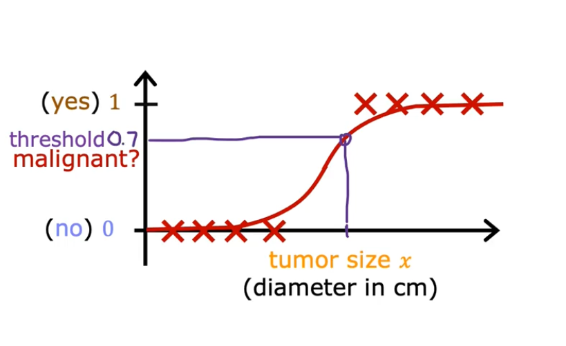
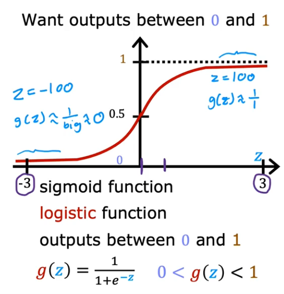
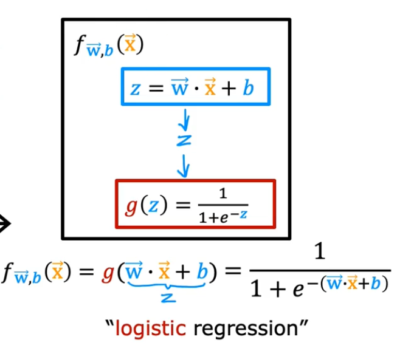
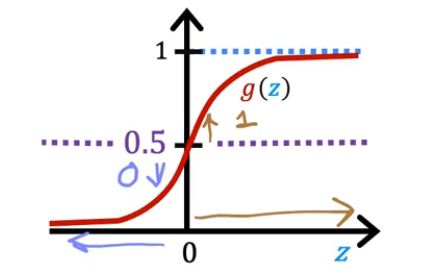
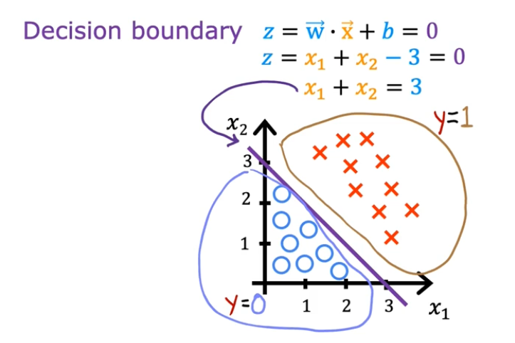
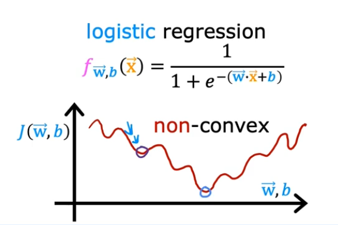
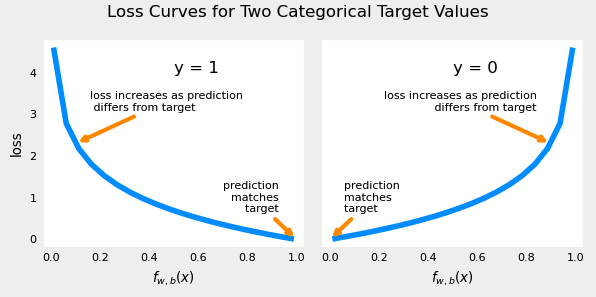

# Logistic Regression

## Classification

- Questions
  - Is this email spam? no | yes
  - Is the transaction fraudulant? no | yes
  - Is the tumor malignant? no | yes
- `y` can only be one of the two values
  - binary classification
- Terminology
  - class = category = label
  - false = 0 (negative class)
  - true = 1 (positive class)

## Classification algorithm

- Based on features, classify if the value is one label or the other
- e.g. based on the tumor size, classify if the cancer is malignant or benign
- For classification, a linear function doesn't work, we need a threshold to say if the predicted value is one label or the other
- The decision boundary of the logistic regression is when the threshold meets the model function. The left side of the boundary will be classified as one label and the right side, the other one.

## Logistic Regression

The classification prediction should output 0 or 1. The sigmoid or logistic function can be used to map all input values to values between 0 and 1

The logistic function fits the data and build the curve and the algorithm outputs the threshold to separate the labels



A classification algorithm can use a logistic function, also called the sigmoid function. A function with an S-shape that outputs between 0 and 1



The logistic regression algorithm computes the linear combination z = xw + b and pass it to the sigmoid activation function.

In numpy, we can use the `exp` function to compute the exponential of a value or an array:

```python
np.exp(1) # 2.718281828459045
np.exp(np.array([1, 2, 3])) # [2.72, 7.39, 20.09]
```

The sigmoid function computes the exponential of the negative value of `z`:

```python
def sigmoid(z):
    """
    Compute the sigmoid of z

    Args:
        z (ndarray): A scalar, numpy array of any size.

    Returns:
        g (ndarray): sigmoid(z), with the same shape as z
         
    """

    return 1 / (1 + np.exp(-z))
```



The interpretation of the logistic regression output

- It outputs the probability that class/label is 1
- e.g.
  - x = tumor size
  - y = 0 for benign
  - y = 1 for malignant
  - f(x) = 0.7 -> 70% chance that y = 1 (cancer is malignant)
- P(y = 0) + P(y = 1) = 1 (100%)

## Decision Boundary



- For a sigmoid activation function, the threshold is 0.5
  - For Z >= 0, Y = 1
  - For Z < 0, Y = 0



- A classification problem where it has two features x1 and x2
  - decision boundary will be a line crossing the graph where it separates the y = 0 and y = 1
- Non-linear decision boundary
  - It can be a polynomial function and not a straight line: circunference, ellipse, cluster/shape

## Cost Function

The cost function in relation to the `w` and `b` forms a non-convex function. But if we try to use gradient descent, there are many "local minima".



The squared error cost function doesn't work for logistic regression. It isn't as smooth as it's for linear regression. The non-linear nature of the model results in  non-convex cost function with many potential local minima.

Logistic regression requires a cost function more suitable to its non-linear nature.

- **Loss** is a measure of the difference of a single example to its target value
- **Cost** is a measure of the losses over the training set

This is defined: 

* $loss(f_{\mathbf{w},b}(\mathbf{x}^{(i)}), y^{(i)})$ is the cost for a single data point, which is:

$$
\begin{equation}
loss(f_{\mathbf{w},b}(\mathbf{x}^{(i)}), y^{(i)}) = \begin{cases}
  - \log\left(f_{\mathbf{w},b}\left( \mathbf{x}^{(i)} \right) \right) & \text{if $y^{(i)}=1$}\\
  - \log \left( 1 - f_{\mathbf{w},b}\left( \mathbf{x}^{(i)} \right) \right) & \text{if $y^{(i)}=0$}
\end{cases}
\end{equation}
$$

*  $f_{\mathbf{w},b}(\mathbf{x}^{(i)})$ is the model's prediction, while $y^{(i)}$ is the target value.

*  $f_{\mathbf{w},b}(\mathbf{x}^{(i)}) = g(\mathbf{w} \cdot\mathbf{x}^{(i)}+b)$ where function $g$ is the sigmoid function.



The defining feature of this loss function is the fact that it uses two separate curves. One for the case when the target is zero or ($y=0$) and another for when the target is one ($y=1$). Combined, these curves provide the behavior useful for a loss function

The loss function above can be rewritten to be easier to implement.
    $$loss(f_{\mathbf{w},b}(\mathbf{x}^{(i)}), y^{(i)}) = (-y^{(i)} \log\left(f_{\mathbf{w},b}\left( \mathbf{x}^{(i)} \right) \right) - \left( 1 - y^{(i)}\right) \log \left( 1 - f_{\mathbf{w},b}\left( \mathbf{x}^{(i)} \right) \right)$$
  
This is a rather formidable-looking equation. It is less daunting when you consider $y^{(i)}$ can have only two values, 0 and 1. One can then consider the equation in two pieces:  
when $ y^{(i)} = 0$, the left-hand term is eliminated:

$$
\begin{align}
loss(f_{\mathbf{w},b}(\mathbf{x}^{(i)}), 0) &= (-(0) \log\left(f_{\mathbf{w},b}\left( \mathbf{x}^{(i)} \right) \right) - \left( 1 - 0\right) \log \left( 1 - f_{\mathbf{w},b}\left( \mathbf{x}^{(i)} \right) \right) \\
&= -\log \left( 1 - f_{\mathbf{w},b}\left( \mathbf{x}^{(i)} \right) \right)
\end{align}
$$

and when $ y^{(i)} = 1$, the right-hand term is eliminated:

$$
\begin{align}
  loss(f_{\mathbf{w},b}(\mathbf{x}^{(i)}), 1) &=  (-(1) \log\left(f_{\mathbf{w},b}\left( \mathbf{x}^{(i)} \right) \right) - \left( 1 - 1\right) \log \left( 1 - f_{\mathbf{w},b}\left( \mathbf{x}^{(i)} \right) \right)\\
  &=  -\log\left(f_{\mathbf{w},b}\left( \mathbf{x}^{(i)} \right) \right)
\end{align}
$$

Based on the value of 𝑦, it selects the appropriate log term in the loss function.
